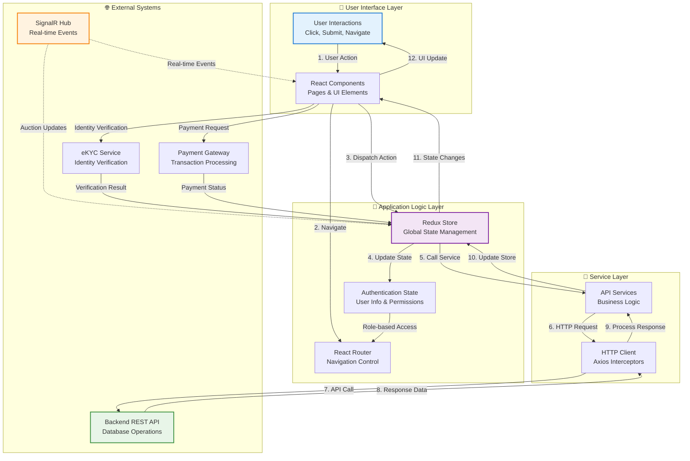
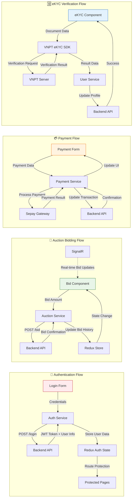
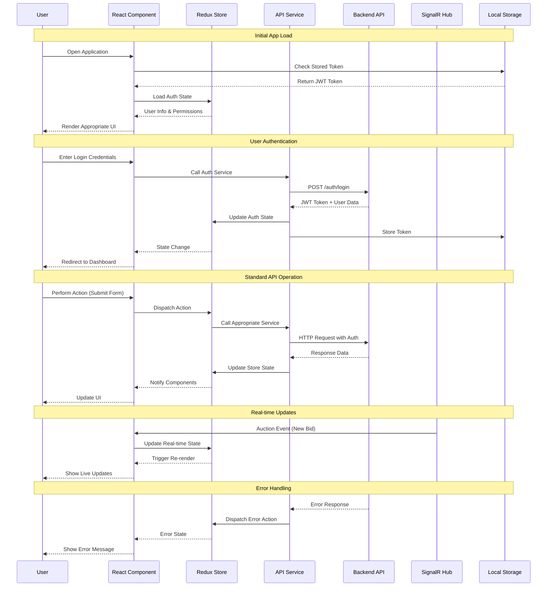
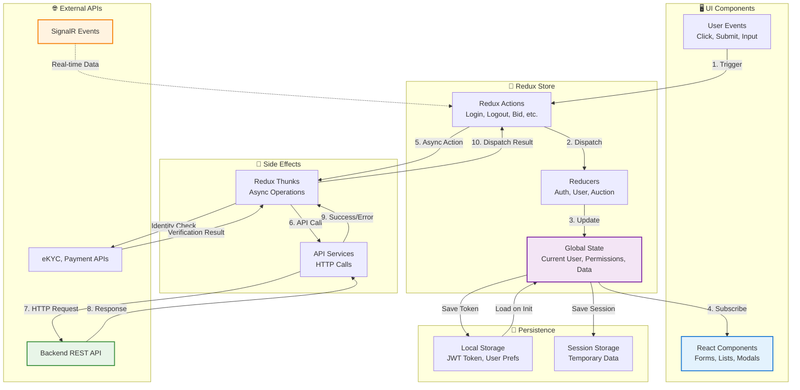
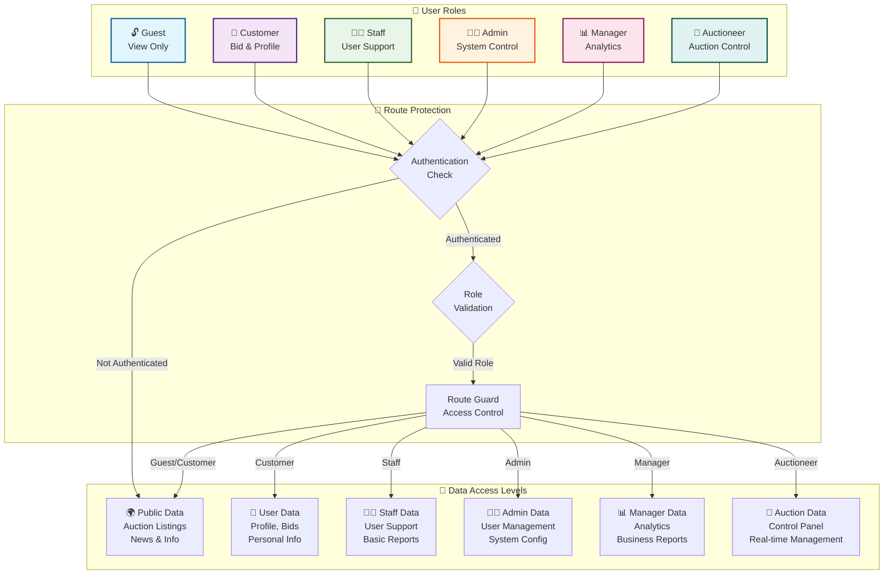
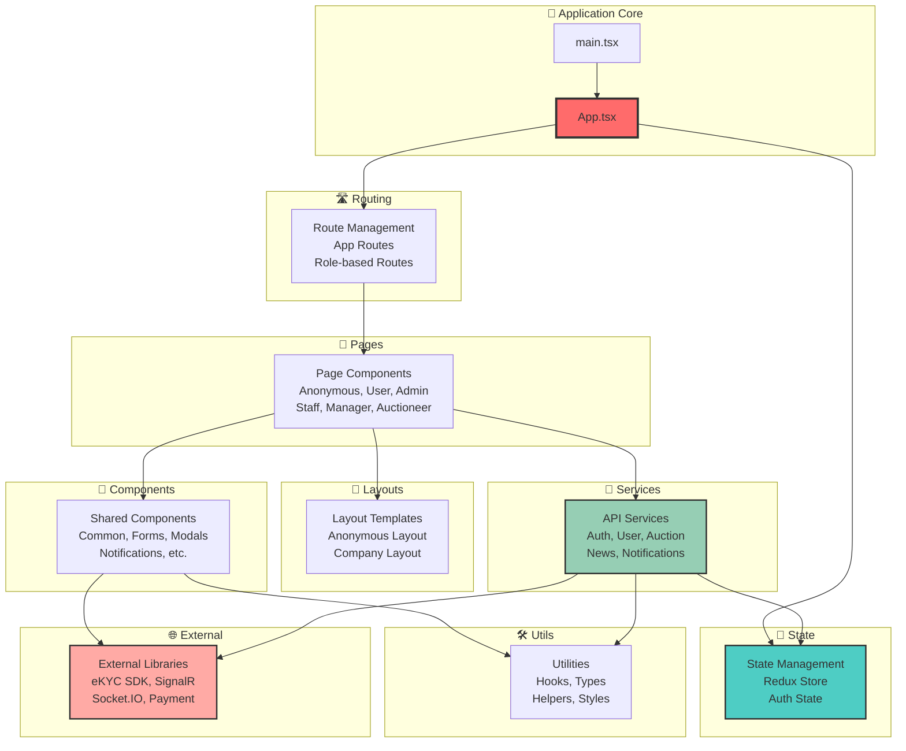
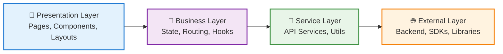

# Digital Auction Frontend - Data Flow Architecture

## 🔄 Main Data Flow Overview

## 📊 Detailed Data Flow by Feature

## 🔄 Complete Application Data Flow

## 🎯 State Management Flow

## 🎯 Role-Based Access & Data Control

## 📋 Data Flow Summary

| Flow Type                    | Source                                    | Destination           | Method           | Purpose                             |
| ---------------------------- | ----------------------------------------- | --------------------- | ---------------- | ----------------------------------- |
| **🔐 Authentication**        | Login Form → Auth Service → Backend       | Redux Store           | POST /auth/login | User authentication & token storage |
| **🔨 Auction Bidding**       | Bid Component → Auction Service → Backend | Redux Store + SignalR | POST /bid        | Place bid & real-time updates       |
| **💳 Payment**               | Payment Form → Payment Service → Gateway  | Backend API           | POST /payment    | Process transactions                |
| **🆔 Identity Verification** | eKYC Component → VNPT SDK → VNPT Server   | User Service          | POST /verify     | Document verification               |
| **📡 Real-time Updates**     | SignalR Hub → Components                  | Redux Store           | WebSocket        | Live auction data                   |
| **🔔 Notifications**         | Backend Events → SignalR → Components     | UI State              | WebSocket        | User notifications                  |
| **🛡️ Route Protection**      | Route Guard → Redux Store                 | Components            | State Check      | Access control                      |

## 📦 Package Diagram - Frontend Module Structure

## 🔗 Architecture Layers

